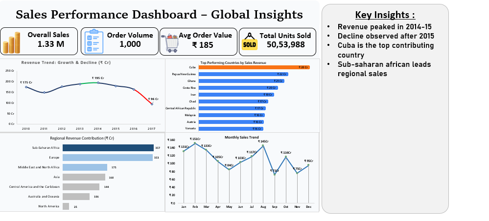

# 📊 Sales Performance Dashboard – Global Insights

## 📌 Project Overview

This project presents a **Sales Performance Dashboard** built to analyze global sales trends, regional contributions, and key business insights.
The dashboard helps stakeholders understand **revenue patterns, top-performing regions, and sales fluctuations over time**.

---

## 🎯 Objective

* Analyze **global sales performance**
* Identify **top contributing countries & regions**
* Track **revenue trends over time**
* Provide **data-driven insights for decision-making**

---

## 🧰 Tools & Technologies

* 📊 Excel (Dashboard Creation)
* 📈 Pivot Tables & Charts
* 🧮 Data Cleaning & Transformation
* 📉 Data Visualization Techniques

---

## 📷 Dashboard Preview



---

## 📊 Key Metrics (KPIs)

* **Overall Sales:** 1.33 Million
* **Order Volume:** 1,000
* **Average Order Value:** ₹185
* **Total Units Sold:** 50,53,988

---

## 📈 Key Insights

* 📌 Revenue peaked during **2014–2015**
* 📉 Decline observed after **2015**
* 🌍 **Cuba** is the top contributing country
* 🌎 **Sub-Saharan Africa** leads regional sales

---

## 📊 Analysis Breakdown

### 🔹 Revenue Trend

* Shows growth and decline patterns over years
* Helps identify peak business periods

### 🔹 Top Performing Countries

* Highlights countries contributing maximum revenue
* Useful for market expansion strategy

### 🔹 Regional Contribution

* Compares revenue across different regions
* Identifies strongest and weakest markets

### 🔹 Monthly Sales Trend

* Tracks seasonal variations
* Helps in demand forecasting

---

## 💡 Business Recommendations

* 📈 Focus on high-performing regions like **Sub-Saharan Africa**
* 🌍 Expand operations in top countries like **Cuba**
* 📉 Investigate reasons behind post-2015 decline
* 📅 Optimize strategy based on monthly trends

---

## 📂 Project Structure

```
├── cleaned_data/
├── final/
│   └── dashboard.png
├── raw_data/
└── README.md
```

---

## 🧠 Skills Demonstrated

* Data Cleaning
* Data Analysis
* Dashboard Design
* Business Insight Generation
* Storytelling with Data

---

## 📢 Conclusion

This dashboard provides a **complete view of sales performance**, enabling better strategic decisions through **data-driven insights**.

---

## ⭐ If you like this project

Give it a ⭐ on GitHub and feel free to connect!
